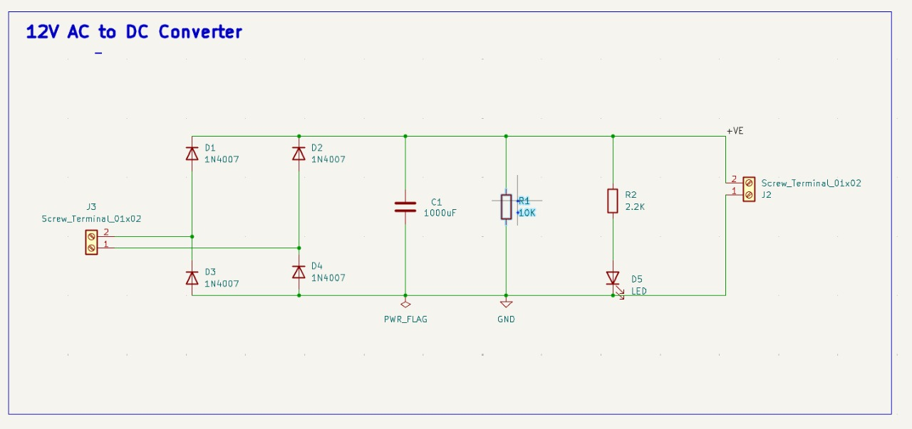
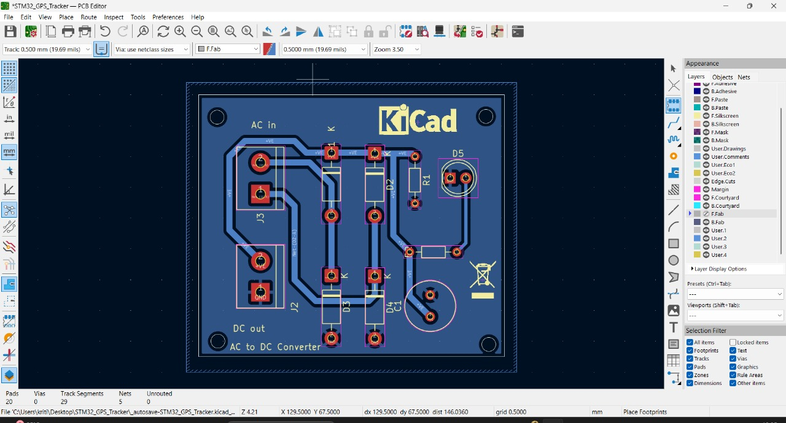
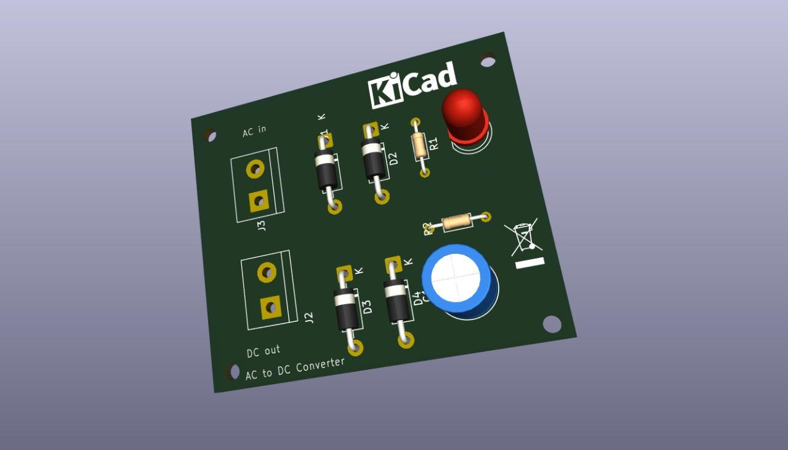

#  12V AC to DC Converter – KiCad Project

##  Project Description

This project involves the design and PCB layout of a **12V AC to DC Converter** using **KiCad**, a powerful open-source PCB design tool. The goal is to convert a 12V AC input into a smoothed DC voltage output suitable for powering basic electronic circuits.

The converter circuit uses a **full-wave bridge rectifier** made with four 1N4007 diodes, followed by a **filtering stage** using a 1000μF capacitor to smooth the rectified voltage. An LED indicator is added to show power availability, along with supporting resistors for safety and functionality.

The entire circuit was **schematically designed**, **footprints assigned**, and a **PCB layout created** in KiCad. The design includes proper spacing, track width, and component alignment, along with a 3D preview to visualize the final product. This board is suitable for hobby projects, prototyping, and can be a base module in many embedded systems requiring DC power.

---

## 🛠 Tools Used

- **KiCad** for schematic capture, PCB design, and 3D visualization

---

##  Project Images

### Schematic Diagram

### PCB Layout (2D)

### 3D View of PCB

---

##  Step-by-Step Process in KiCad

### 1. **Schematic Design**
- Open **KiCad Eeschema** and create the circuit.
- Used components:
  - **4x Diodes (1N4007)** for full bridge rectification
  - **1x Capacitor (1000µF)** for filtering
  - **2x Resistors (10kΩ and 2.2kΩ)** for biasing and current limiting
  - **1x LED** for power indication
  - **2x Screw Terminals (J2, J3)** for AC input and DC output

### 2. **Assign Footprints**
- Used the **Symbol to Footprint Assignment Tool**.
- Ensured all components had appropriate THT (Through Hole Technology) footprints.

### 3. **PCB Layout**
- Launched **PCB Editor**.
- Placed components compactly and logically.
- Routed tracks manually with 0.5mm width.
- Maintained clearances and avoided track overlap.
- Added labels like "AC in", "DC out", and "KiCad".

### 4. **3D Visualization**
- Used KiCad’s **3D Viewer** to verify design before fabrication.
- Ensured component orientation and silkscreen alignment.

### 5. **Final Checks**
- Verified DRC (Design Rule Check) passed.
- Ensured no unconnected nets.
- Exported Gerber files if ready for manufacturing.

---

##  Component Footprints Used

| Symbol | Value   | Footprint |
|--------|---------|-----------|
| C1     | 1000uF  | Capacitor_THT:C_Radial_D8.0mm_H11.5mm_P3.50mm |
| D1-D4  | 1N4007  | Diode_THT:D_DO-41_SOD81_P10.16mm_Horizontal   |
| D5     | LED     | LED_THT:LED_D5.0mm                            |
| J2/J3  | Terminal Block | TerminalBlock_bornier-2_P5.08mm         |
| R1     | 10k     | Resistor_THT:R_Axial_DIN0204_P7.62mm         |
| R2     | 2.2k    | Resistor_THT:R_Axial_DIN0204_P7.62mm         |

---

##  Output

- Input: 12V AC (via J3)
- Output: Smoothed DC ~10-12V (via J2, after rectification and filtering)

---

##  Project Files

- `Schematic.kicad_sch`
- `PCB.kicad_pcb`
- `Footprints.pretty/`
- `3D_Model.step`
- `Gerber/` (optional if fabrication planned)

---

##  Applications

- Basic electronics power supply
- Embedded systems requiring DC input
- Educational and learning purposes

---

##  Notes

- Make sure to test your output with a multimeter before connecting to other electronics.
- You can upgrade the circuit with a voltage regulator (e.g., 7805) if a specific regulated voltage is needed.

---

##  Author

**Kritika Sinha**  
B.Tech – Cyber Physical Systems  

---

